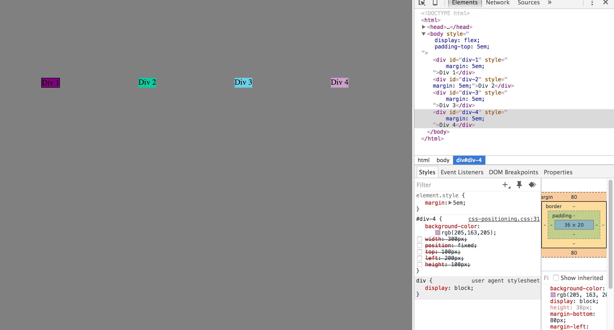

How can you use Chrome's DevTools inspector to help you format or position elements?
-Formatting or positioning elements with Devtools is a matter of playing around with the values of the position, top, left, bottom, and right properties among others.
How can you resize elements on the DOM using CSS?
-Resizing elements on the DOM consists of changing the values of the height and width properties.
What are the differences between absolute, fixed, static, and relative positioning? Which did you find easiest to use? Which was most difficult?
-Absolute positioning is having the element's position fixed relative to a parent element; Fixed positioning is when the element's position is fixed, meaning even if the rest of the document scrolls, the element stays fixed; Static positioning is the default and effectively turns off positioning; and relative positioning is when the element's position is shifted relative to its normal position. I was having difficulty internalizing and understanding the differences among the 4 position types so none of them were easy to use.
What are the differences between margin, border, and padding?
Padding defines the space between the element border and the element content; Margin defines the space around the element, and border allows users to pick the style and color of an element's border.
What was your impression of this challenge overall? (love, hate, and why?)
I had mixed feelings about this challenge-- It felt like a lot of this challenge was about trial and error and a lot of guesswork which was frustrating, but it was also fun in the sense that we didn't have direct instructions which was a good way to self-learn.
