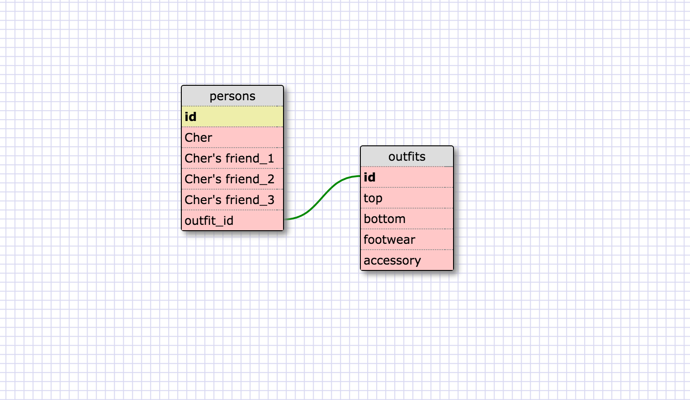

1. SELECT * FROM states;
2. SELECT * FROM regions;
3. SELECT state_name,population FROM states;
4. SELECT state_name,population FROM states ORDER BY population DESC;
5. SELECT state_name FROM states WHERE region_id=7;
6. SELECT state_name,population_density FROM states WHERE population_density>50 ORDER BY population_density;
7. SELECT state_name FROM states WHERE population BETWEEN 1000000 AND 1500000;
8. SELECT state_name,region_id FROM states ORDER BY region_id ASC;
9.SELECT region_name FROM regions WHERE region_name LIKE "%Central%";
10. SELECT regions.region_name,states.state_name FROM states INNER JOIN regions ON states.region_id=regions.id ORDER BY regions.id ASC;

Reflection
What are databases for?
-Databases are used to store and organize information.

What is a one-to-many relationship?
-A one-to-many relationship connects one element to another element. In the previous example with states, there is one state connected to a region. The region, however, has many states that comprise it.

What is a primary key? What is a foreign key? How can you determine which is which?
-A primary key is unique in each record. A foreign key is a column or multiple columns that are connected to the primary key. So a foreign key in one table points to a primary key in another table.

How can you select information out of a SQL database? What are some general guidelines for that?
-Selecting information out of a SQL database generally is done with the keyword 'SELECT'. Depending on how you want to select or sort the data, you can use various keywords in addition to SELECT.