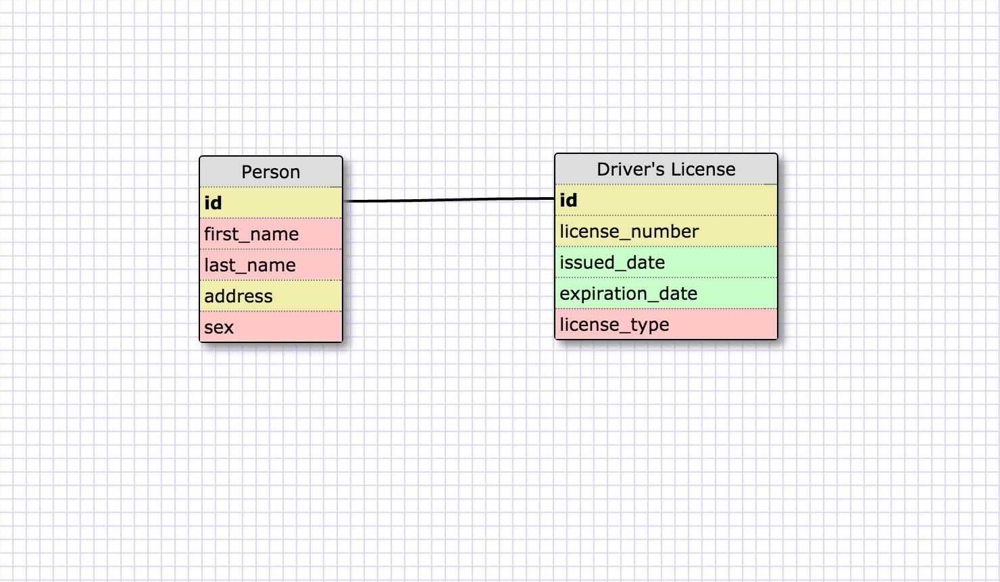
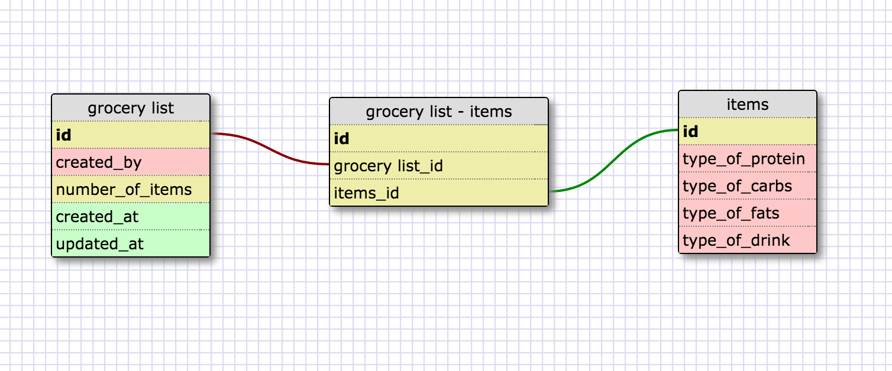

This is a one to one database because one person can have only one license,
and one license can belong to only one person.

##What is a one-to-one database?
A one to one relationship is one that connects two tables in such a way that any 
given row from one table can have only one matching row in the other table. In the
example above, there is only one driver license per person, and one person can 
only have one license.

## hen would you use a one-to-one database? (Think generally, not in terms of the 
example you created).
- We would use a one-to-one database when we can't include all the data in one table.
If one table cannot encapsulate or should not encapsulate specific data, then it'd
be in our best interest to divide the data into two separate tables.

##What is a many-to-many database?
- A many-to-many database is one which is used when multiple rows in one table 
can be related to multiple rows in another table. For example, classes have 
multiple students, and students can enroll in multiple classes.

##When would you use a many-to-many database? (Think generally, not in terms of 
the example you created).
- We would use a many-to-many database when we entities that have attributes 
which can vary and are related to attributes of other entities.

##What is confusing about database schemas? What makes sense?
- I think like anything else, this will be confusing in general in the beginning,
but will be more clear with time and practice.